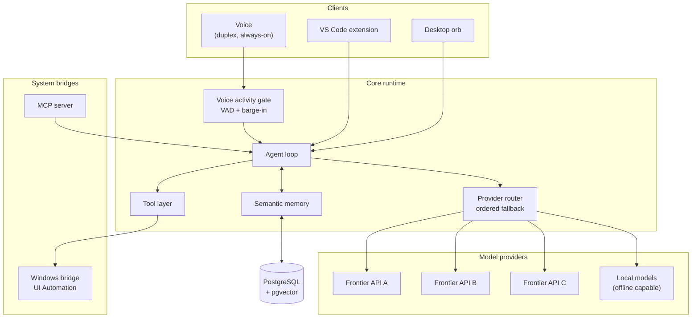

# Lumina

**A voice-first AI assistant platform for Windows.**

Lumina runs on your own machine and combines four things most assistants keep separate:
multi-provider LLM orchestration, an agent tool layer that can actually operate the
computer, real-time duplex voice, and long-term semantic memory.

This repository is the **public face** of the project — architecture, design decisions,
and roadmap. The product source code is private. See
[What is public and what is not](#what-is-public-and-what-is-not).

---

## Why this repository exists

Most of what makes a system worth studying is not its source code. It is the set of
decisions behind it: what was traded away, what failed first, and why the current shape
won. Those decisions are documented here in the open, even though the implementation is
not.

If you are evaluating this project — as a collaborator, an employer, or someone building
something similar — start with [Design decisions](#design-decisions). That is where the
engineering actually lives.

---

## Architecture at a glance

A request from voice travels: **microphone → activity gate → agent loop → provider router
→ tools → system bridges → response → speech**, with memory read before the model call and
written after it.

---

## Components

| Component | Responsibility |
|---|---|
| **Provider router** | Routes each call across multiple model providers with an ordered fallback chain. A provider outage degrades quality instead of breaking the assistant. |
| **Voice activity gate** | Duplex-aware voice detection. Lets the user interrupt mid-sentence without the assistant cutting itself off on its own output. |
| **Agent loop** | Plans and executes multi-step work, calling tools and re-planning on their results. |
| **Tool layer** | The assistant's hands: messaging, email, web search, media generation, file and system operations. |
| **Semantic memory** | Long-term recall across sessions using vector search over prior conversations and extracted facts. |
| **Windows bridge** | Reads and controls third-party desktop applications through UI Automation, including notification capture and reply. |
| **MCP server** | Exposes the platform's tools over the Model Context Protocol so external AI clients can drive it. |

---

## Design decisions

The reasoning behind the architecture, one document per decision:

| # | Decision |
|---|---|
| [0001](docs/decisions/0001-multi-provider-fallback.md) | Route across multiple model providers instead of committing to one |
| [0002](docs/decisions/0002-duplex-voice-barge-in.md) | Build a custom voice activity gate instead of using push-to-talk |
| [0003](docs/decisions/0003-pgvector-over-dedicated-vector-db.md) | Store embeddings in PostgreSQL rather than a dedicated vector database |
| [0004](docs/decisions/0004-ui-automation-over-apis.md) | Automate the desktop through UI Automation instead of per-app APIs |

Deeper system detail: [docs/architecture.md](docs/architecture.md)
Where the project is going: [docs/roadmap.md](docs/roadmap.md)

---

## Project status

Lumina is in active private development and runs daily on the author's own machine as its
primary test environment. It is not currently distributed as a public build.

Public releases were previously hosted in this repository and have been withdrawn while
the project is restructured. This repository now serves documentation only.

---

## What is public and what is not

**Public:** architecture, design decisions, trade-offs, roadmap, and — over time —
standalone libraries extracted from the platform where they are useful on their own.

**Private:** product source code, model prompts, integration logic, credentials, and any
client work.

This split is deliberate. The parts worth sharing are the ones that help other engineers;
the parts kept back are the ones that constitute the product.

---

## Contact

**Daldier Garcia** — AI & Full-Stack Engineer
[lessamtv@gmail.com](mailto:lessamtv@gmail.com)

---

## License

© Daldier Garcia. All rights reserved.

The contents of this repository are published for reading. No license is granted to
reuse, redistribute, or create derivative works from this documentation. Any libraries
extracted from the platform will be published in their own repositories under their own
explicit open-source licenses.
