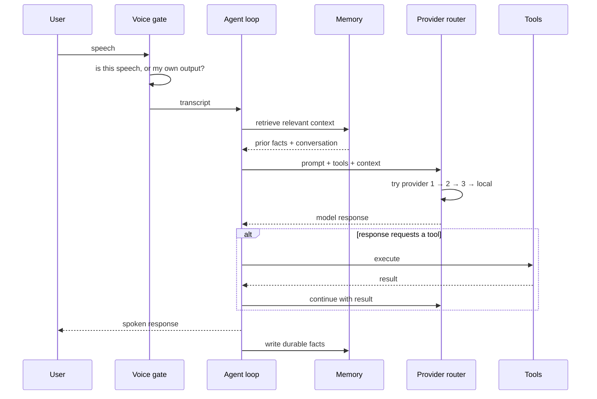

# Architecture

This document describes how Lumina is put together and why the boundaries fall where they
do. It covers structure and behaviour, not implementation.

---

## Design constraints

Every decision in this system traces back to four constraints:

1. **It runs on the user's machine.** Not a cloud service the user talks to — a program
   with access to their files, their applications, and their desktop. This makes
   capability cheap and safety expensive.
2. **Voice is the primary interface, not a feature.** A voice interface that pauses,
   talks over you, or has to be pushed to talk is worse than a text box. That sets a
   latency and interruption budget the rest of the system must respect.
3. **No single model provider can be a hard dependency.** Outages, rate limits, and
   pricing changes are routine. A design that assumes one provider is always available
   is a design that is offline several times a month.
4. **Memory must survive the session.** An assistant that forgets everything on restart
   cannot be trusted with ongoing work.

---

## Request lifecycle

The two loops that matter are **retry** (inside the router, invisible to everything above
it) and **re-plan** (inside the agent loop, when a tool result changes the plan).

---

## Layers

### Clients

Three surfaces share one core: a voice interface, a VS Code extension for
development-oriented work, and a always-on-top desktop orb. They differ in presentation
only — the same agent loop and the same tools serve all three. Adding a surface does not
mean re-implementing capability.

### Core runtime

**Provider router.** Wraps every model call. Holds an ordered chain of providers and walks
it on failure. Callers do not know or care which provider answered. See
[ADR 0001](decisions/0001-multi-provider-fallback.md).

**Voice activity gate.** Sits between the microphone and the agent. Decides what is user
speech, what is the assistant's own audio returning through the room, and when an
interruption is genuine. See [ADR 0002](decisions/0002-duplex-voice-barge-in.md).

**Agent loop.** Plans, calls tools, reads results, re-plans. The tool layer is declarative:
each tool describes itself and the model selects from those descriptions, so adding a
capability is adding a description and a handler — never a change to the loop.

**Semantic memory.** Two tiers. Conversation context within a session, and durable facts
extracted at session close and embedded for later retrieval. Retrieval runs before the
model call; extraction runs after. See
[ADR 0003](decisions/0003-pgvector-over-dedicated-vector-db.md).

### System bridges

**Windows bridge.** The assistant's access to the desktop: reading window contents,
driving controls, capturing notifications, and replying to them. Built on UI Automation
rather than per-application APIs. See
[ADR 0004](decisions/0004-ui-automation-over-apis.md).

**MCP server.** Exposes the platform's tools over the Model Context Protocol, so external
AI clients can drive Lumina the same way Lumina drives itself. The platform is both an
agent and a tool provider.

---

## Failure behaviour

The system is built so that failures degrade rather than cascade:

| Failure | Result |
|---|---|
| One model provider is down | Router falls through to the next; user sees nothing |
| Every remote provider is down | Falls through to local models; reduced quality, still working |
| Database unreachable | Session continues without long-term recall |
| A tool throws | Result is returned to the agent as a failed observation; it re-plans |
| Voice pipeline fails | Text surfaces remain fully functional |

The rule: **no single dependency may take the assistant offline.**

---

## Security posture

The assistant holds real capability — filesystem access, application control, the ability
to send messages on the user's behalf. That is the point of the product and also its main
risk. The design assumptions:

- Credentials live in environment configuration, never in code and never in this repository.
- Outbound actions that reach other people are distinguished from local actions, and are
  gated differently.
- The system is single-user and local-first. It is not multi-tenant and does not attempt
  to be.
